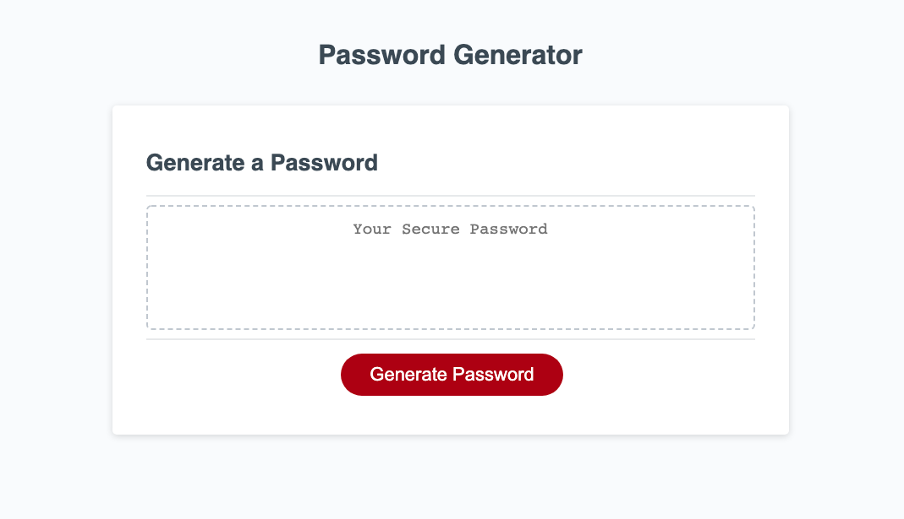

# Password Generator

This generator creates passwords of 8-128 characters, allowing the user to chose whether to use uppercase, lowercase, numbers, and special characters.

The live site can be viewed at https://davepaulsanders.github.io/password-generator/

## Screenshots

## Technology

This project was written using HTML, CSS, and Javascript.

## Installation

To use this project, clone the repository to your computer using HTTPS or SSH.
